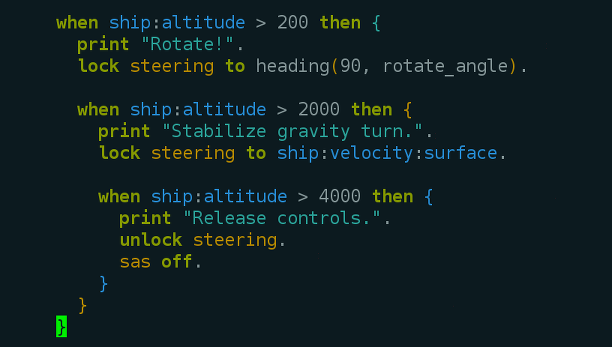

ks-mode
=======


ks-mode is an Emacs major mode for editing Kerboscript, the language of the
[kOS Scriptable Autopilot](http://ksp-kos.github.io/KOS_DOC/) for
[Kerbal Space Program](https://kerbalspaceprogram.com/en/).

Features
--------
 * Syntax highlighting for Kerboscript's keywords, built-in functions and
   constants.
 * Growing list of highlights for known object suffixes like
   `SHIP:VELOCITY:ORBIT`.
 * Strong auto-indentation. It can handle all the examples in kslib. Try
   `ks-indent-buffer`.

Planned Features
----------------
 * Interaction with the kOS processor. (Think `C-c C-c` to run your script
   live in KSP).

Installation
------------
Clone this repository, or just download [ks.el](ks.el).

If you use vanilla Emacs, you might want something like this in your
`.emacs` file:

```elisp
(add-to-list 'load-path "~/src/ks-mode/")
(require 'ks)
```

If you use [Emacs Prelude](http://batsov.com/prelude/) (I love it), just drop
`ks.el` in `~/.emacs.d/personal`.

Perhaps one day, ks-mode will be a MELPA package, and this section will not be
needed.

Configuration
-------------
The default indentation size is 2 spaces. You can change it with:
```elisp
(setq ks-indent 4)
```

Communication
-------------
Please get in touch if you have any trouble, have a feature request, or just
want to say 'hi' to a fellow _Kerbal Space Programmer_.

`toby@jarpy.net` or `@jarpy` on Twitter.

If you get any value from ks-mode, then you've made my day.

Contributing
------------
If you find a bug, particularly with auto-indentation, please tell me. I will
be very grateful!  A snippet of Kerboscript that indents incorrectly is all
that's needed.

If you're feeling adventurous however, the indentation code is covered by
behavioural acceptance tests written with Cucumber.  By all means write a
new test if you'd like to. Should you *then* go on and write Lisp that
causes the test to pass... well... :green_heart:.
